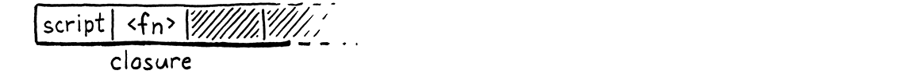
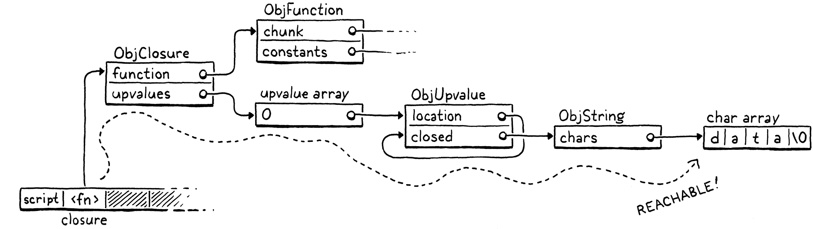
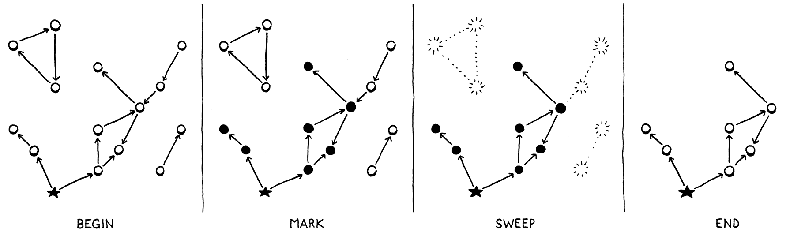
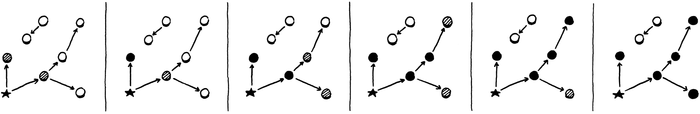
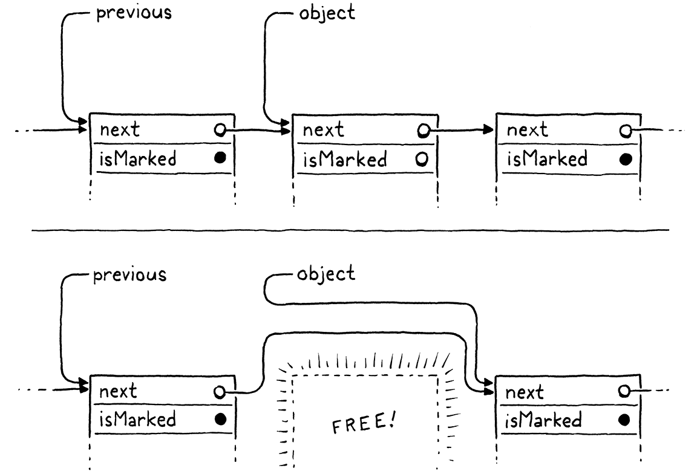
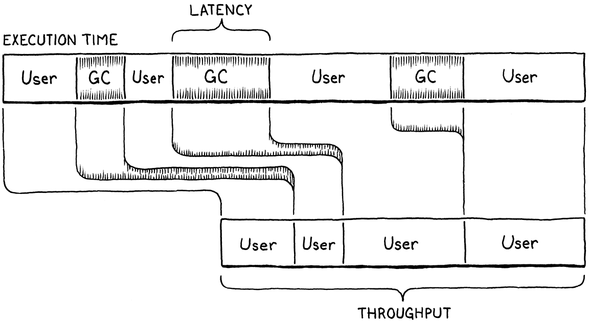

# 26.垃圾回收 Garbage Collection

> I wanna, I wanna,
> I wanna, I wanna,
> I wanna be trash.
>
> ​						——  The Whip, “Trash”

【譯者注：The Whip樂隊的歌曲，歌詞也沒必要翻譯了】

> We say Lox is a “high-level” language because it frees programmers from worrying about details irrelevant to the problem they’re solving. The user becomes an executive, giving the machine abstract goals and letting the lowly computer figure out how to get there.

我們說Lox是一種“高級”語言，因為它使得程序員不必擔心那些與他們要解決的問題無關的細節。用戶變成了執行者，給機器設定抽象的目標，讓底層的計算機自己想辦法實現目標。

> Dynamic memory allocation is a perfect candidate for automation. It’s necessary for a working program, tedious to do by hand, and yet still error-prone. The inevitable mistakes can be catastrophic, leading to crashes, memory corruption, or security violations. It’s the kind of risky-yet-boring work that machines excel at over humans.

動態內存分配是自動化的最佳選擇。這是一個基本可用的程序所必需的，手動操作很繁瑣，而且很容易出錯。不可避免的錯誤可能是災難性的，會導致崩潰、內存損壞或安全漏洞。機器比人類更擅長這種既有風險又無聊的工作。

> This is why Lox is a **managed language**, which means that the language implementation manages memory allocation and freeing on the user’s behalf. When a user performs an operation that requires some dynamic memory, the VM automatically allocates it. The programmer never worries about deallocating anything. The machine ensures any memory the program is using sticks around as long as needed.

這就是為什麼Lox是一種**託管語言**，這意味著語言實現會代表用戶管理內存的分配與釋放。當用戶執行某個需要動態內存的操作時，虛擬機會自動分配。程序員不用擔心任何釋放內存的事情。機器會確保程序使用的任意內存會在需要的時候存在。

> Lox provides the illusion that the computer has an infinite amount of memory. Users can allocate and allocate and allocate and never once think about where all these bytes are coming from. Of course, computers do not yet *have* infinite memory. So the way managed languages maintain this illusion is by going behind the programmer’s back and reclaiming memory that the program no longer needs. The component that does this is called a **garbage collector**.

Lox提供了一種計算機擁有無限內存的錯覺。用戶可以不停地分配、分配、再分配，而不用考慮這些內存是從哪裡來的。當然，計算機還沒有無限的內存。因此，託管語言維持這種錯覺的方式是揹著程序員，回收程序不再需要的內存。實現這一點的組件被稱為**垃圾回收器**。

> ## 26 . 1 Reachability

## 26.1 可達性

> This raises a surprisingly difficult question: how does a VM tell what memory is *not* needed? Memory is only needed if it is read in the future, but short of having a time machine, how can an implementation tell what code the program *will* execute and which data it *will* use? Spoiler alert: VMs cannot travel into the future. Instead, the language makes a conservative approximation: it considers a piece of memory to still be in use if it *could possibly* be read in the future.

這就引出了一個非常困難的問題：虛擬機如何分辨哪些內存是不需要的？內存只有在未來被讀取時才需要，但是如果沒有時間機器，語言如何知道程序將執行哪些代碼，使用哪些數據？劇透警告：虛擬機不能穿越到未來。相反，語言做了一個保守的估計[^1]：如果一塊內存在未來*有可能*被讀取，就認為它仍然在使用。

> That sounds *too* conservative. Couldn’t *any* bit of memory potentially be read? Actually, no, at least not in a memory-safe language like Lox. Here’s an example:

這聽起來*太*保守了。難道不是內存中的*任何*比特都可能被讀取嗎？事實上，不是，至少在Lox這樣內存安全的語言中不是。下面是一個例子：

```c
var a = "first value";
a = "updated";
// GC here.
print a;
```

> Say we run the GC after the assignment has completed on the second line. The string “first value” is still sitting in memory, but there is no way for the user’s program to ever get to it. Once `a` got reassigned, the program lost any reference to that string. We can safely free it. A value is **reachable** if there is some way for a user program to reference it. Otherwise, like the string “first value” here, it is **unreachable**.

假設我們在完成第二行的賦值之後運行GC。字符串“first value”仍然在內存中，但是用戶的程序沒有辦法訪訪問它。一旦`a`被重新賦值，程序就失去了對該字符串的任何引用，我們可以安全地釋放它。如果用戶程序可以通過某種方式引用一個值，這個值就是可達的。否則，就像這裡的字符串“first value”一樣，它是不可達的。

> Many values can be directly accessed by the VM. Take a look at:

許多值可以被虛擬機直接訪問。請看：

```javascript
var global = "string";
{
  var local = "another";
  print global + local;
}
```

> Pause the program right after the two strings have been concatenated but before the `print` statement has executed. The VM can reach `"string"` by looking through the global variable table and finding the entry for `global`. It can find `"another"` by walking the value stack and hitting the slot for the local variable `local`. It can even find the concatenated string `"stringanother"` since that temporary value is also sitting on the VM’s stack at the point when we paused our program.

在兩個字符串連接之後但是`print`語句執行之前暫停程序。虛擬機可以通過查看全局變量表，並查找`global`條目到達`"string"`。它可以通過遍歷值棧，並找到局部變量`local`的棧槽來找到`"another"`。它甚至也可以找到連接後的字符串`"stringanother"`，因為在我們暫停程序的時候，這個臨時值也在虛擬機的棧中。

> All of these values are called **roots**. A root is any object that the VM can reach directly without going through a reference in some other object. Most roots are global variables or on the stack, but as we’ll see, there are a couple of other places the VM stores references to objects that it can find.

所有這些值都被稱為**根**。根是虛擬機可以無需通過其它對象的引用而直接到達的任何對象。大多數根是全局變量或在棧上，但正如我們將看到的，還有其它一些地方，虛擬機會在其中存儲它可以找到的對象的引用。

> Other values can be found by going through a reference inside another value. Fields on instances of classes are the most obvious case, but we don’t have those yet. Even without those, our VM still has indirect references. Consider:

其它值可以通過另一個值中的引用來找到。類實例中的字段是最明顯的情況，但我們目前還沒有類。即使沒有這些，我們的虛擬機中仍然存在間接引用。考慮一下：

```javascript
fun makeClosure() {
  var a = "data";

  fun f() { print a; }
  return f;
}

{
  var closure = makeClosure();
  // GC here.
  closure();
}
```

> Say we pause the program on the marked line and run the garbage collector. When the collector is done and the program resumes, it will call the closure, which will in turn print `"data"`. So the collector needs to *not* free that string. But here’s what the stack looks like when we pause the program:

假設我們在標記的行上暫停並運行垃圾回收器。當回收器完成、程序恢復時，它將會調用閉包，然後輸出`"data"`。所以回收器需要*不釋放*那個字符串。但當我們暫停程序時，棧是這樣的：



> The `"data"` string is nowhere on it. It has already been hoisted off the stack and moved into the closed upvalue that the closure uses. The closure itself is on the stack. But to get to the string, we need to trace through the closure and its upvalue array. Since it *is* possible for the user’s program to do that, all of these indirectly accessible objects are also considered reachable.

`"data"`字符串並不在上面。它已經被從棧中提取出來，並移動到閉包所使用的關閉上值中。閉包本身在棧上。但是要得到字符串，我們需要跟蹤閉包及其上值數組。因為用戶的程序可能會這樣做，所有這些可以間接訪問的對象也被認為是可達的。



> This gives us an inductive definition of reachability:

這給了我們一個關於可達性的歸納定義：

> - All roots are reachable.
> - Any object referred to from a reachable object is itself reachable.

* 所有根都是可達的。
* 任何被某個可達對象引用的對象本身是可達的。

> These are the values that are still “live” and need to stay in memory. Any value that *doesn’t* meet this definition is fair game for the collector to reap. That recursive pair of rules hints at a recursive algorithm we can use to free up unneeded memory:

這些是仍然“存活”、需要留在內存中的值。任何*不符合*這個定義的值，對於回收器來說都是可收割的獵物。這一對遞歸規則暗示了我們可以用一個遞歸算法來釋放不需要的內存：

> 1. Starting with the roots, traverse through object references to find the full set of reachable objects.
> 2. Free all objects *not* in that set.

1. 從根開始，遍歷對象引用，找到可達對象的完整集合。
2. 釋放不在集合中的所有對象。

> Many different garbage collection algorithms are in use today, but they all roughly follow that same structure. Some may interleave the steps or mix them, but the two fundamental operations are there. They mostly differ in *how* they perform each step.

如今有很多不同的垃圾回收算法，但是它們都大致遵循相同的結構。有些算法可能會將這些步驟進行交叉或混合，但這兩個基本操作是存在的。不同算法的區別在於*如何*執行每個步驟[^2]。

> ## 26 . 2 Mark-Sweep Garbage Collection

## 26.2 標記-清除垃圾回收

> The first managed language was Lisp, the second “high-level” language to be invented, right after Fortran. John McCarthy considered using manual memory management or reference counting, but eventually settled on (and coined) garbage collection—once the program was out of memory, it would go back and find unused storage it could reclaim.

第一門託管語言是Lisp，它是繼Fortran之後發明的第二種“高級”語言。John McCarthy曾考慮使用手動內存管理或引用計數，但最終還是選擇（並創造了）垃圾回收——一旦程序的內存用完了，它就會回去尋找可以回收的未使用的存儲空間[^3]。

> He designed the very first, simplest garbage collection algorithm, called **mark-and-sweep** or just **mark-sweep**. Its description fits in three short paragraphs in the initial paper on Lisp. Despite its age and simplicity, the same fundamental algorithm underlies many modern memory managers. Some corners of CS seem to be timeless.

他設計了最早的、最簡單的垃圾回收算法，被稱為**標記並清除（mark-and-sweep）**，或者就叫**標記清除（mark-sweep）**。在最初的Lisp論文中，關於它的描述只有短短的三段。儘管它年代久遠且簡單，但許多現代內存管理器都使用了相同的基本算法。CS中的一些角落似乎是永恆的。

> As the name implies, mark-sweep works in two phases:

顧名思義，標記-清除分兩個階段工作：

> - **Marking:** We start with the roots and traverse or *trace* through all of the objects those roots refer to. This is a classic graph traversal of all of the reachable objects. Each time we visit an object, we *mark* it in some way. (Implementations differ in how they record the mark.)
> - **Sweeping:** Once the mark phase completes, every reachable object in the heap has been marked. That means any unmarked object is unreachable and ripe for reclamation. We go through all the unmarked objects and free each one.
>

* **標記**：我們從根開始，遍歷或跟蹤這些根所引用的所有對象。這是對所有可達對象的經典圖式遍歷。每次我們訪問一個對象時，我們都用某種方式來標記它。（不同的實現方式，記錄標記的方法也不同）
* **清除**：一旦標記階段完成，堆中的每個可達對象都被標記了。這意味著任何未被標記的對象都是不可達的，可以被回收。我們遍歷所有未被標記的對象，並逐個釋放。

> It looks something like this:

它看起來像是這樣的[^4]：



> That’s what we’re gonna implement. Whenever we decide it’s time to reclaim some bytes, we’ll trace everything and mark all the reachable objects, free what didn’t get marked, and then resume the user’s program.
>

這就是我們要實現的。每當我們決定是時候回收一些字節的時候，我們就會跟蹤一切，並標記所有可達的對象，釋放沒有被標記的對象，然後恢復用戶的程序。

> ### 26 . 2 . 1 Collecting garbage

### 26.2.1 回收垃圾

> This entire chapter is about implementing this one function:

整個章節都是關於實現這一個函數的[^5]：

*<u>memory.h，在reallocate()方法後添加代碼：</u>*

```c
void* reallocate(void* pointer, size_t oldSize, size_t newSize);
// 新增部分開始
void collectGarbage();
// 新增部分結束
void freeObjects();
```

> We’ll work our way up to a full implementation starting with this empty shell:

我們會從這個空殼開始逐步完整實現：

*<u>memory.c，在freeObject()方法後添加代碼：</u>*

```c
void collectGarbage() {
}
```

> The first question you might ask is, When does this function get called? It turns out that’s a subtle question that we’ll spend some time on later in the chapter. For now we’ll sidestep the issue and build ourselves a handy diagnostic tool in the process.

你可能會問的第一個問題是，這個函數在什麼時候被調用？事實證明，這是一個微妙的問題，我們會在後面的章節中花些時間討論。現在，我們先回避這個問題，並在這個過程中為自己構建一個方便的診斷工具。

*<u>common.h，添加代碼：</u>*

```c
#define DEBUG_TRACE_EXECUTION
// 新增部分開始
#define DEBUG_STRESS_GC
// 新增部分結束
#define UINT8_COUNT (UINT8_MAX + 1)
```

> We’ll add an optional “stress test” mode for the garbage collector. When this flag is defined, the GC runs as often as it possibly can. This is, obviously, horrendous for performance. But it’s great for flushing out memory management bugs that occur only when a GC is triggered at just the right moment. If *every* moment triggers a GC, you’re likely to find those bugs.

我們將為垃圾回收器添加一個可選的“壓力測試”模式。當定義這個標誌後，GC就會盡可能頻繁地運行。顯然，這對性能來說是很糟糕的。但它對於清除內存管理bug很有幫助，這些bug只有在適當的時候觸發GC時才會出現。如果每時每刻都觸發GC，那你很可能會找到這些bug。

*<u>memory.c，在reallocate()方法中添加代碼：</u>*

```c
void* reallocate(void* pointer, size_t oldSize, size_t newSize) {
  // 新增部分開始
  if (newSize > oldSize) {
#ifdef DEBUG_STRESS_GC
    collectGarbage();
#endif
  }
  // 新增部分結束
  if (newSize == 0) {
```

> Whenever we call `reallocate()` to acquire more memory, we force a collection to run. The if check is because `reallocate()` is also called to free or shrink an allocation. We don’t want to trigger a GC for that—in particular because the GC itself will call `reallocate()` to free memory.

每當我們調用`reallocate()`來獲取更多內存時，都會強制運行一次回收。這個`if`檢查是因為，在釋放或收縮分配的內存時也會調用`reallocate()`。我們不希望在這種時候觸發GC——特別是因為GC本身也會調用`reallocate()`來釋放內存。

> Collecting right before allocation is the classic way to wire a GC into a VM. You’re already calling into the memory manager, so it’s an easy place to hook in the code. Also, allocation is the only time when you really *need* some freed up memory so that you can reuse it. If you *don’t* use allocation to trigger a GC, you have to make sure every possible place in code where you can loop and allocate memory also has a way to trigger the collector. Otherwise, the VM can get into a starved state where it needs more memory but never collects any.

在分配之前進行回收是將GC引入虛擬機的經典方式[^6]。你已經在調用內存管理器了，所以這是個很容易掛接代碼的地方。另外，分配是唯一你真的*需要*一些釋放出來的內存的時候，這樣你就可以重新使用它。如果*不*使用分配來觸發GC，則必須確保代碼中每個可以循環和分配內存的地方都有觸發回收器的方法。否則，虛擬機會進入飢餓狀態，它需要更多的內存，但卻沒有回收到任何內存。

> ### 26 . 2 . 2 Debug logging

### 26.2.2 調試日誌

> While we’re on the subject of diagnostics, let’s put some more in. A real challenge I’ve found with garbage collectors is that they are opaque. We’ve been running lots of Lox programs just fine without any GC *at all* so far. Once we add one, how do we tell if it’s doing anything useful? Can we tell only if we write programs that plow through acres of memory? How do we debug that?

既然我們在討論診斷的問題，那我們再加入一些內容。我發現垃圾回收器的一個真正的挑戰在於它們是不透明的。到目前為止，我們已經在沒有任何GC的情況下運行了很多Lox程序。一旦我們添加了GC，我們如何知道它是否在做有用的事情？只有當我們編寫的程序耗費了大量的內存時，我們才能知道嗎？我們該如何調試呢？

> An easy way to shine a light into the GC’s inner workings is with some logging.

瞭解GC內部工作的一種簡單方式是進行一些日誌記錄。

*<u>common.h，添加代碼：</u>*

```c
#define DEBUG_STRESS_GC
// 新增部分開始
#define DEBUG_LOG_GC
// 新增部分結束
#define UINT8_COUNT (UINT8_MAX + 1)
```

> When this is enabled, clox prints information to the console when it does something with dynamic memory.

啟用這個功能後，當clox使用動態內存執行某些操作時，會將信息打印到控制檯。

> We need a couple of includes.

我們需要一些引入。

*<u>memory.c，添加代碼：</u>*

```c
#include "vm.h"
// 新增部分開始
#ifdef DEBUG_LOG_GC
#include <stdio.h>
#include "debug.h"
#endif
// 新增部分結束
void* reallocate(void* pointer, size_t oldSize, size_t newSize) {
```

> We don’t have a collector yet, but we can start putting in some of the logging now. We’ll want to know when a collection run starts.

我們還沒有回收器，但我們現在可以開始添加一些日誌記錄。我們想要知道回收是在何時開始的。

*<u>memory.c，在collectGarbage()方法中添加代碼：</u>*

```c
void collectGarbage() {
// 新增部分開始
#ifdef DEBUG_LOG_GC
  printf("-- gc begin\n");
#endif
// 新增部分結束
}
```

> Eventually we will log some other operations during the collection, so we’ll also want to know when the show’s over.

最終，我們會在回收過程中記錄一些其它操作，因此我們也想知道回收什麼時候結束。

*<u>memory.c，在collectGarbage()方法中添加代碼：</u>*

```c
  printf("-- gc begin\n");
#endif
// 新增部分開始
#ifdef DEBUG_LOG_GC
  printf("-- gc end\n");
#endif
// 新增部分結束
}
```

> We don’t have any code for the collector yet, but we do have functions for allocating and freeing, so we can instrument those now.

我們還沒有關於回收器的任何代碼，但是我們有分配和釋放的函數，所以我們現在可以對這些函數進行檢測。

*<u>object.c，在allocateObject()方法中添加代碼：</u>*

```c
  vm.objects = object;
// 新增部分開始  
#ifdef DEBUG_LOG_GC
  printf("%p allocate %zu for %d\n", (void*)object, size, type);
#endif
// 新增部分結束
  return object;
```

> And at the end of an object’s lifespan:

在對象的生命週期結束時：

*<u>memory.c，在freeObject()方法中添加代碼：</u>*

```c
static void freeObject(Obj* object) {
// 新增部分開始
#ifdef DEBUG_LOG_GC
  printf("%p free type %d\n", (void*)object, object->type);
#endif
// 新增部分結束
  switch (object->type) {
```

> With these two flags, we should be able to see that we’re making progress as we work through the rest of the chapter.

有了這兩個標誌，我們應該能夠看到我們在本章其餘部分的學習中取得了進展。

> ## 26 . 3 Marking the Roots

## 26.3 標記根

> Objects are scattered across the heap like stars in the inky night sky. A reference from one object to another forms a connection, and these constellations are the graph that the mark phase traverses. Marking begins at the roots.

對象就像漆黑夜空中的星星一樣散落在堆中。從一個對象到另一個對象的引用形成了一種連接，而這些星座就是標記階段需要遍歷的圖。標記是從根開始的。

*<u>memory.c，在collectGarbage()方法中添加代碼：</u>*

```c
#ifdef DEBUG_LOG_GC
  printf("-- gc begin\n");
#endif
  // 新增部分開始
  markRoots();
  // 新增部分結束
#ifdef DEBUG_LOG_GC
```

> Most roots are local variables or temporaries sitting right in the VM’s stack, so we start by walking that.

大多數根是虛擬機棧中的局部變量或臨時變量，因此我們從遍歷棧開始：

*<u>memory.c，在freeObject()方法後添加代碼：</u>*

```c
static void markRoots() {
  for (Value* slot = vm.stack; slot < vm.stackTop; slot++) {
    markValue(*slot);
  }
}
```

> To mark a Lox value, we use this new function:

為了標記Lox值，我們使用這個新函數：

*<u>memory.h，在reallocate()方法後添加代碼：</u>*

```c
void* reallocate(void* pointer, size_t oldSize, size_t newSize);
// 新增部分開始
void markValue(Value value);
// 新增部分結束
void collectGarbage();
```

> Its implementation is here:

它的實現在這裡：

*<u>memory.c，在reallocate()方法後添加代碼：</u>*

```c
void markValue(Value value) {
  if (IS_OBJ(value)) markObject(AS_OBJ(value));
}
```

> Some Lox values—numbers, Booleans, and `nil`—are stored directly inline in Value and require no heap allocation. The garbage collector doesn’t need to worry about them at all, so the first thing we do is ensure that the value is an actual heap object. If so, the real work happens in this function:

一些Lox值（數字、布爾值和`nil`）直接內聯存儲在Value中，不需要堆分配。垃圾回收器根本不需要擔心這些，因此我們要做的第一件事是確保值是一個真正的堆對象。如果是這樣，真正的工作就發生在這個函數中：

*<u>memory.h，在reallocate()方法後添加代碼：</u>*

```c
void* reallocate(void* pointer, size_t oldSize, size_t newSize);
// 新增部分開始
void markObject(Obj* object);
// 新增部分結束
void markValue(Value value);
```

> Which is defined here:

下面是定義：

*<u>memory.c，在reallocate()方法後添加代碼：</u>*

```c
void markObject(Obj* object) {
  if (object == NULL) return;
  object->isMarked = true;
}
```

> The `NULL` check is unnecessary when called from `markValue()`. A Lox Value that is some kind of Obj type will always have a valid pointer. But later we will call this function directly from other code, and in some of those places, the object being pointed to is optional.
>

從`markValue()`中調用時，`NULL`檢查是不必要的。某種Obj類型的Lox Value一定會有一個有效的指針。但稍後我們將從其它代碼中直接調用這個函數，在其中一些地方，被指向的對象是可選的。

Assuming we do have a valid object, we mark it by setting a flag. That new field lives in the Obj header struct all objects share.

假設我們確實有一個有效的對象，我們通過設置一個標誌來標記它。這個新字段存在於所有對象共享的Obj頭中。

*<u>object.h，在結構體Obj中添加代碼：</u>*

```c
  ObjType type;
  // 新增部分開始
  bool isMarked;
  // 新增部分結束
  struct Obj* next;
```

> Every new object begins life unmarked because we haven’t yet determined if it is reachable or not.

每個新對象在開始時都沒有標記，因為我們還不確定它是否可達。

*<u>object.c，在allocateObject()方法中添加代碼：</u>*

```c
  object->type = type;
  // 新增部分開始
  object->isMarked = false;
  // 新增部分結束
  object->next = vm.objects;
```

> Before we go any farther, let’s add some logging to `markObject()`.
>

在進一步討論之前，我們先在`markObject()`中添加一些日誌。

*<u>memory.c，在markObject()方法中添加代碼：</u>*

```c
void markObject(Obj* object) {
  if (object == NULL) return;
// 新增部分開始  
#ifdef DEBUG_LOG_GC
  printf("%p mark ", (void*)object);
  printValue(OBJ_VAL(object));
  printf("\n");
#endif
// 新增部分結束
  object->isMarked = true;
```

> This way we can see what the mark phase is doing. Marking the stack takes care of local variables and temporaries. The other main source of roots are the global variables.

這樣我們就可以看到標記階段在做什麼。對棧進行標記可以處理局部變量和臨時變量。另一個根的主要來源就是全局變量。

*<u>memory.c，在markRoots()方法中添加代碼：</u>*

```c
    markValue(*slot);
  }
  // 新增部分開始
  markTable(&vm.globals);
  // 新增部分結束
}
```

> Those live in a hash table owned by the VM, so we’ll declare another helper function for marking all of the objects in a table.

它們位於VM擁有的一個哈希表中，因此我們會聲明另一個輔助函數來標記表中的所有對象。

*<u>table.h，在tableFindString()方法後添加代碼：</u>*

```c
ObjString* tableFindString(Table* table, const char* chars,
                           int length, uint32_t hash);
// 新增部分開始                           
void markTable(Table* table);
// 新增部分結束
#endif
```

> We implement that in the “table” module here:

我們在“table”模塊中實現它：

*<u>table.c，在tableFindString()方法後添加代碼：</u>*

```c
void markTable(Table* table) {
  for (int i = 0; i < table->capacity; i++) {
    Entry* entry = &table->entries[i];
    markObject((Obj*)entry->key);
    markValue(entry->value);
  }
}
```

> Pretty straightforward. We walk the entry array. For each one, we mark its value. We also mark the key strings for each entry since the GC manages those strings too.

非常簡單。我們遍歷條目數組。對於每個條目，我們標記其值。我們還會標記每個條目的鍵字符串，因為GC也要管理這些字符串。

> ### 26 . 3 . 1 Less obvious roots

### 26.3.1 不明顯的根

> Those cover the roots that we typically think of—the values that are obviously reachable because they’re stored in variables the user’s program can see. But the VM has a few of its own hidey-holes where it squirrels away references to values that it directly accesses.

這些覆蓋了我們通常認為的根——那些明顯可達的值，因為它們存儲在用戶程序可以看到的變量中。但是虛擬機也有一些自己的藏身之所，可以隱藏對直接訪問的值的引用。

> Most function call state lives in the value stack, but the VM maintains a separate stack of CallFrames. Each CallFrame contains a pointer to the closure being called. The VM uses those pointers to access constants and upvalues, so those closures need to be kept around too.

大多數函數調用狀態都存在於值棧中，但是虛擬機維護了一個單獨的CallFrame棧。每個CallFrame都包含一個指向被調用閉包的指針。VM使用這些指針來訪問常量和上值，所以這些閉包也需要被保留下來。

*<u>memory.c，在markRoots()方法中添加代碼：</u>*

```c
  }
  // 新增部分開始
  for (int i = 0; i < vm.frameCount; i++) {
    markObject((Obj*)vm.frames[i].closure);
  }
  // 新增部分結束
  markTable(&vm.globals);
```

> Speaking of upvalues, the open upvalue list is another set of values that the VM can directly reach.

說到上值，開放上值列表是VM可以直接訪問的另一組值。

*<u>memory.c，在markRoots()方法中添加代碼：</u>*

```c
  for (int i = 0; i < vm.frameCount; i++) {
    markObject((Obj*)vm.frames[i].closure);
  }
  // 新增部分開始
  for (ObjUpvalue* upvalue = vm.openUpvalues;
       upvalue != NULL;
       upvalue = upvalue->next) {
    markObject((Obj*)upvalue);
  }
  // 新增部分結束
  markTable(&vm.globals);
```

> Remember also that a collection can begin during *any* allocation. Those allocations don’t just happen while the user’s program is running. The compiler itself periodically grabs memory from the heap for literals and the constant table. If the GC runs while we’re in the middle of compiling, then any values the compiler directly accesses need to be treated as roots too.

還要記住，回收可能會在*任何*分配期間開始。這些分配並不僅僅是在用戶程序運行的時候發生。編譯器本身會定期從堆中獲取內存，用於存儲字面量和常量表。如果GC在編譯期間運行，那麼編譯器直接訪問的任何值也需要被當作根來處理。

> To keep the compiler module cleanly separated from the rest of the VM, we’ll do that in a separate function.

為了保持編譯器模塊與虛擬機的其它部分完全分離，我們在一個單獨的函數中完成這一工作。

*<u>memory.c，在markRoots()方法中添加代碼：</u>*

```c
  markTable(&vm.globals);
  // 新增部分開始
  markCompilerRoots();
  // 新增部分結束
}
```

> It’s declared here:

它是在這裡聲明的：

*<u>compiler.h，在compile()方法後添加代碼：</u>*

```c
ObjFunction* compile(const char* source);
// 新增部分開始
void markCompilerRoots();
// 新增部分結束
#endif
```

> Which means the “memory” module needs an include.

這意味著“memory”模塊需要引入頭文件。

*<u>memory.c，添加代碼：</u>*

```c
#include <stdlib.h>
// 新增部分開始
#include "compiler.h"
// 新增部分結束
#include "memory.h"
```

> And the definition is over in the “compiler” module.

定義在“compiler”模塊中。

*<u>compiler.c，在compile()方法後添加代碼：</u>*

```c
void markCompilerRoots() {
  Compiler* compiler = current;
  while (compiler != NULL) {
    markObject((Obj*)compiler->function);
    compiler = compiler->enclosing;
  }
}
```

> Fortunately, the compiler doesn’t have too many values that it hangs on to. The only object it uses is the ObjFunction it is compiling into. Since function declarations can nest, the compiler has a linked list of those and we walk the whole list.

幸運的是，編譯器並沒有太多掛載的值。它唯一使用的對象是它正在編譯的ObjFunction。由於函數聲明可以嵌套，編譯器有一個函數聲明的鏈表，我們遍歷整個列表。

> Since the “compiler” module is calling `markObject()`, it also needs an include.

因為“compiler”模塊會調用`markObject()`，也需要引入。

*<u>compiler.c，添加代碼：</u>*

```c
#include "compiler.h"
// 新增部分開始
#include "memory.h"
// 新增部分結束
#include "scanner.h"
```

> Those are all the roots. After running this, every object that the VM—runtime and compiler—can get to *without* going through some other object has its mark bit set.

這些就是所有的根。運行這段程序後，虛擬機（運行時和編譯器）無需通過其它對象就可以達到的每個對象，其標記位都被設置了。

> ## 26 . 4 Tracing Object References

## 26.4 跟蹤對象引用

> The next step in the marking process is tracing through the graph of references between objects to find the indirectly reachable values. We don’t have instances with fields yet, so there aren’t many objects that contain references, but we do have some. In particular, ObjClosure has the list of ObjUpvalues it closes over as well as a reference to the raw ObjFunction that it wraps. ObjFunction, in turn, has a constant table containing references to all of the literals created in the function’s body. This is enough to build a fairly complex web of objects for our collector to crawl through.

標記過程的下一步是跟蹤對象之間的引用圖，找到間接可達的對象。我們現在還沒有帶有字段的實例，因此包含引用的對象不多，但確實有一些。特別的，ObjClosure擁有它所關閉的ObjUpvalue列表，以及它所包裝的指向原始ObjFunction的引用[^7]。反過來，ObjFunction有一個常量表，包含函數體中創建的所有字面量的引用。這足以構建一個相當複雜的對象網絡，供回收器爬取。

> Now it’s time to implement that traversal. We can go breadth-first, depth-first, or in some other order. Since we just need to find the *set* of all reachable objects, the order we visit them mostly doesn’t matter.

現在是時候實現遍歷了。我們可以按照廣度優先、深度優先或其它順序進行遍歷。因為我們只需要找到所有可達對象的集合，所以訪問它們的順序幾乎沒有影響[^8]。

> ### 26 . 4 . 1 The tricolor abstraction

### 26.4.1 三色抽象

> As the collector wanders through the graph of objects, we need to make sure it doesn’t lose track of where it is or get stuck going in circles. This is particularly a concern for advanced implementations like incremental GCs that interleave marking with running pieces of the user’s program. The collector needs to be able to pause and then pick up where it left off later.

當回收器在對象圖中漫遊時，我們需要確保它不會失去對其位置的跟蹤或者陷入循環。這對於像增量GC這樣的高級實現來說尤其值得關注，因為增量GC將標記與用戶程序的的運行部分交織在一起。回收器需要能夠暫停，稍後在停止的地方重新開始。

> To help us soft-brained humans reason about this complex process, VM hackers came up with a metaphor called the **tricolor abstraction**. Each object has a conceptual “color” that tracks what state the object is in, and what work is left to do.

為了幫助我們這些愚蠢的人類理解這個複雜的過程，虛擬機專家們想出了一個稱為**三色抽象**的比喻。每個對象都有一個概念上的“顏色”，用於追蹤對象處於什麼狀態，以及還需要做什麼工作[^9]。

> - ** White:** At the beginning of a garbage collection, every object is white. This color means we have not reached or processed the object at all.
> - ** Gray:** During marking, when we first reach an object, we darken it gray. This color means we know the object itself is reachable and should not be collected. But we have not yet traced *through* it to see what *other* objects it references. In graph algorithm terms, this is the *worklist*—the set of objects we know about but haven’t processed yet.
> - ** Black:** When we take a gray object and mark all of the objects it references, we then turn the gray object black. This color means the mark phase is done processing that object.
>

* ** 白色:** 在垃圾回收的開始階段，每個對象都是白色的。這種顏色意味著我們根本沒有達到或處理該對象。
* ** 灰色:** 在標記過程中，當我們第一次達到某個對象時，我們將其染為灰色。這種顏色意味著我們知道這個對象本身是可達的，不應該被收集。但我們還沒有*通過*它來跟蹤它引用的*其它*對象。用圖算法的術語來說，這就是*工作列表（worklist）*——我們知道但還沒有被處理的對象集合。
* ** 黑色:** 當我們接受一個灰色對象，並將其引用的所有對象全部標記後，我們就把這個灰色對象變為黑色。這種顏色意味著標記階段已經完成了對該對象的處理。

> In terms of that abstraction, the marking process now looks like this:

從這個抽象的角度看，標記過程新增看起來是這樣的：

> 1. Start off with all objects white.
> 2. Find all the roots and mark them gray.
> 3. Repeat as long as there are still gray objects:
>    1. Pick a gray object. Turn any white objects that the object mentions to gray.
>    2. Mark the original gray object black.
>

1. 開始時，所有對象都是白色的。
2. 找到所有的根，將它們標記為灰色。
3. 只要還存在灰色對象，就重複此過程：
   1. 選擇一個灰色對象。將該對象引用的所有白色對象標記為灰色。
   2. 將原來的灰色對象標記為黑色。

> I find it helps to visualize this. You have a web of objects with references between them. Initially, they are all little white dots. Off to the side are some incoming edges from the VM that point to the roots. Those roots turn gray. Then each gray object’s siblings turn gray while the object itself turns black. The full effect is a gray wavefront that passes through the graph, leaving a field of reachable black objects behind it. Unreachable objects are not touched by the wavefront and stay white.

我發現把它可視化很有幫助。你有一個對象網絡，對象之間有引用。最初，它們都是小白點。旁邊是一些虛擬機的傳入邊，這些邊指向根。這些根變成了灰色。然後每個灰色對象的兄弟節點變成灰色，而該對象本身變成黑色。完整的效果是一個灰色波前穿過圖，在它後面留下一個可達的黑色對象區域。不可達對象不會被波前觸及，並保持白色。



> At the end, you’re left with a sea of reached, black objects sprinkled with islands of white objects that can be swept up and freed. Once the unreachable objects are freed, the remaining objects—all black—are reset to white for the next garbage collection cycle.

最後，你會看到一片可達的、黑色對象組成的海洋，其中點綴著可以清除和釋放的白色對象組成的島嶼。一旦不可達的對象被釋放，剩下的對象（全部為黑色）會被重置為白色，以便在下一個垃圾收集週期使用[^10]。

> ### 26 . 4 . 2 A worklist for gray objects

### 26.4.2 灰色對象的工作列表

> In our implementation we have already marked the roots. They’re all gray. The next step is to start picking them and traversing their references. But we don’t have any easy way to find them. We set a field on the object, but that’s it. We don’t want to have to traverse the entire object list looking for objects with that field set.

在我們的實現中，我們已經對根進行了標記。它們都是灰色的。下一步是開始挑選灰色對象並遍歷其引用。但是我們沒有任何簡單的方法來查找灰色對象。我們在對象上設置了一個字段，但也僅此而已。我們不希望遍歷整個對象列表來查找設置了該字段的對象。

> Instead, we’ll create a separate worklist to keep track of all of the gray objects. When an object turns gray, in addition to setting the mark field we’ll also add it to the worklist.

相反，我們創建一個單獨的工作列表來跟蹤所有的灰色對象。當某個對象變成灰色時，除了設置標記字段外，我們還會將它添加到工作列表中。

*<u>memory.c，在markObject()方法中添加代碼：</u>*

```c
  object->isMarked = true;
  // 新增部分開始
  if (vm.grayCapacity < vm.grayCount + 1) {
    vm.grayCapacity = GROW_CAPACITY(vm.grayCapacity);
    vm.grayStack = (Obj**)realloc(vm.grayStack,
                                  sizeof(Obj*) * vm.grayCapacity);
  }

  vm.grayStack[vm.grayCount++] = object;
  // 新增部分結束
}
```

> We could use any kind of data structure that lets us put items in and take them out easily. I picked a stack because that’s the simplest to implement with a dynamic array in C. It works mostly like other dynamic arrays we’ve built in Lox, *except*, note that it calls the *system* `realloc()` function and not our own `reallocate()` wrapper. The memory for the gray stack itself is *not* managed by the garbage collector. We don’t want growing the gray stack during a GC to cause the GC to recursively start a new GC. That could tear a hole in the space-time continuum.

我們可以使用任何類型的數據結構，讓我們可以輕鬆地放入和取出項目。我選擇了棧，因為這是用C語言實現動態數組最簡單的方法。它的工作原理與我們在Lox中構建的其它動態數組基本相同，*除了一點*，要注意它調用了*系統*的`realloc()`函數，而不是我們自己包裝的`reallocate()`。灰色對象棧本身的內存是*不被*垃圾回收器管理的。我們不希望因為GC過程中增加灰色對象棧，導致GC遞歸地發起一個新的GC。這可能會在時空連續體上撕開一個洞。

> We’ll manage its memory ourselves, explicitly. The VM owns the gray stack.

我們會自己顯式地管理它的內存。VM擁有這個灰色棧。

*<u>vm.h，在結構體VM中添加代碼：</u>*

```c
  Obj* objects;
  // 新增部分開始
  int grayCount;
  int grayCapacity;
  Obj** grayStack;
  // 新增部分結束
} VM;
```

> It starts out empty.

開始時是空的。

*<u>vm.c，在initVM()方法中添加代碼：</u>*

```c
  vm.objects = NULL;
  // 新增部分開始
  vm.grayCount = 0;
  vm.grayCapacity = 0;
  vm.grayStack = NULL;
  // 新增部分結束
  initTable(&vm.globals);
```

> And we need to free it when the VM shuts down.

當VM關閉時，我們需要釋放它。

*<u>memory.c，在freeObjects()方法中添加代碼：</u>*

```c
    object = next;
  }
  // 新增部分開始
  free(vm.grayStack);
  // 新增部分結束
}
```

> We take full responsibility for this array. That includes allocation failure. If we can’t create or grow the gray stack, then we can’t finish the garbage collection. This is bad news for the VM, but fortunately rare since the gray stack tends to be pretty small. It would be nice to do something more graceful, but to keep the code in this book simple, we just abort.

我們對這個數組負擔全部責任，其中包括分配失敗。如果我們不能創建或擴張灰色棧，那我們就無法完成垃圾回收。這對VM來說是個壞消息，但幸運的是這很少發生，因為灰色棧往往是非常小的。如果能做得更優雅一些就好了，但是為了保持本書中的代碼簡單，我們就停在這裡吧[^11]。

*<u>memory.c，在markObject()方法中添加代碼：</u>*

```c
    vm.grayStack = (Obj**)realloc(vm.grayStack,
                                  sizeof(Obj*) * vm.grayCapacity);
    // 新增部分開始
    if (vm.grayStack == NULL) exit(1);
    // 新增部分結束
  }
```

> ### 26 . 4 . 3 Processing gray objects

### 26.4.3 處理灰色對象

> OK, now when we’re done marking the roots, we have both set a bunch of fields and filled our work list with objects to chew through. It’s time for the next phase.

好了，現在我們在完成對根的標記後，既設置了一堆字段，也用待處理的對象填滿了我們的工作列表。是時候進入下一階段了。

*<u>memory.c，在collectGarbage()方法中添加代碼：</u>*

```c
  markRoots();
  // 新增部分開始
  traceReferences();
  // 新增部分結束
#ifdef DEBUG_LOG_GC
```

> Here’s the implementation:

下面是其實現：

*<u>memory.c，在markRoots()方法後添加代碼：</u>*

```c
static void traceReferences() {
  while (vm.grayCount > 0) {
    Obj* object = vm.grayStack[--vm.grayCount];
    blackenObject(object);
  }
}
```

> It’s as close to that textual algorithm as you can get. Until the stack empties, we keep pulling out gray objects, traversing their references, and then marking them black. Traversing an object’s references may turn up new white objects that get marked gray and added to the stack. So this function swings back and forth between turning white objects gray and gray objects black, gradually advancing the entire wavefront forward.

這與文本描述的算法已經儘可能接近了。在棧清空之前，我們會不斷取出灰色對象，遍歷它們的引用，然後將它們標記為黑色。遍歷某個對象的引用可能會出現新的白色對象，這些對象被標記為灰色並添加到棧中。所以這個函數在把白色對象變成灰色和把灰色對象變成黑色之間來回擺動，逐漸把整個波前向前推進。

> Here’s where we traverse a single object’s references:

下面是我們遍歷某個對象的引用的地方：

<u>*memory.c，在markValue()方法後添加代碼：*</u>

```c
static void blackenObject(Obj* object) {
  switch (object->type) {
    case OBJ_NATIVE:
    case OBJ_STRING:
      break;
  }
}
```

> Each object kind has different fields that might reference other objects, so we need a specific blob of code for each type. We start with the easy ones—strings and native function objects contain no outgoing references so there is nothing to traverse.

每種對象類型都有不同的可能引用其它對象的字段，因此我們需要為每種類型編寫一塊特定的代碼。我們從簡單的開始——字符串和本地函數對象不包含向外的引用，因此沒有任何東西需要遍歷[^12]。

> Note that we don’t set any state in the traversed object itself. There is no direct encoding of “black” in the object’s state. A black object is any object whose `isMarked` field is set and that is no longer in the gray stack.

注意，我們沒有在已被遍歷的對象本身中設置任何狀態。在對象的狀態中，沒有對“black”的直接編碼。黑色對象是`isMarked`字段被設置且不再位於灰色棧中的任何對象[^13]。

> Now let’s start adding in the other object types. The simplest is upvalues.

現在讓我們開始添加其它的對象類型。最簡單的是上值。

*<u>memory.c，在blackenObject()方法中添加代碼：</u>*

```c
static void blackenObject(Obj* object) {
  switch (object->type) {    
    // 新增部分開始
    case OBJ_UPVALUE:
      markValue(((ObjUpvalue*)object)->closed);
      break;
    // 新增部分結束  
    case OBJ_NATIVE:
```

> When an upvalue is closed, it contains a reference to the closed-over value. Since the value is no longer on the stack, we need to make sure we trace the reference to it from the upvalue.

當某個上值被關閉後，它包含一個指向關閉值的引用。由於該值不在棧上，我們需要確保從上值中跟蹤對它的引用。

> Next are functions.

接下來是函數。

*<u>memory.c，在blackenObject()方法中添加代碼：</u>*

```c
  switch (object->type) {
    // 新增部分開始
    case OBJ_FUNCTION: {
      ObjFunction* function = (ObjFunction*)object;
      markObject((Obj*)function->name);
      markArray(&function->chunk.constants);
      break;
    }
    // 新增部分結束
    case OBJ_UPVALUE:
```

> Each function has a reference to an ObjString containing the function’s name. More importantly, the function has a constant table packed full of references to other objects. We trace all of those using this helper:

每個函數都有一個對包含函數名稱的ObjString 的引用。更重要的是，函數有一個常量表，其中充滿了對其它對象的引用。我們使用這個輔助函數來跟蹤它們：

*<u>memory.c，在markValue()方法後添加代碼：</u>*

```c
static void markArray(ValueArray* array) {
  for (int i = 0; i < array->count; i++) {
    markValue(array->values[i]);
  }
}
```

> The last object type we have now—we’ll add more in later chapters—is closures.

我們現在擁有的最後一種對象類型（我們會在後面的章節中添加更多）是閉包。

*<u>memory.c，在blackenObject()方法中添加代碼：</u>*

```c
  switch (object->type) {  
    // 新增部分開始
    case OBJ_CLOSURE: {
      ObjClosure* closure = (ObjClosure*)object;
      markObject((Obj*)closure->function);
      for (int i = 0; i < closure->upvalueCount; i++) {
        markObject((Obj*)closure->upvalues[i]);
      }
      break;
    }
    // 新增部分結束
    case OBJ_FUNCTION: {
```

> Each closure has a reference to the bare function it wraps, as well as an array of pointers to the upvalues it captures. We trace all of those.

每個閉包都有一個指向其包裝的裸函數的引用，以及一個指向它所捕獲的上值的指針數組。我們要跟蹤所有這些。

> That’s the basic mechanism for processing a gray object, but there are two loose ends to tie up. First, some logging.

這就是處理灰色對象的基本機制，但還有兩個未解決的問題。首先，是一些日誌記錄。

*<u>memory.c，在blackenObject()中添加代碼：</u>*

```c
static void blackenObject(Obj* object) {
// 新增部分開始
#ifdef DEBUG_LOG_GC
  printf("%p blacken ", (void*)object);
  printValue(OBJ_VAL(object));
  printf("\n");
#endif
// 新增部分結束
  switch (object->type) {
```

> This way, we can watch the tracing percolate through the object graph. Speaking of which, note that I said *graph*. References between objects are directed, but that doesn’t mean they’re *acyclic!* It’s entirely possible to have cycles of objects. When that happens, we need to ensure our collector doesn’t get stuck in an infinite loop as it continually re-adds the same series of objects to the gray stack.

這樣一來，我們就可以觀察到跟蹤操作在對象圖中的滲入情況。說到這裡，請注意，我說的是圖。對象之間的引用是有方向的，但這並不意味著它們是無循環的！完全有可能出現對象的循環。當這種情況發生時，我們需要確保，我們的回收器不會因為持續將同一批對象添加到灰色堆棧而陷入無限循環。

> The fix is easy.

解決方法很簡單。

*<u>memory.c，在markObject()方法中添加代碼：</u>*

```c
  if (object == NULL) return;
  // 新增部分開始
  if (object->isMarked) return;
  // 新增部分結束
#ifdef DEBUG_LOG_GC
```

> If the object is already marked, we don’t mark it again and thus don’t add it to the gray stack. This ensures that an already-gray object is not redundantly added and that a black object is not inadvertently turned back to gray. In other words, it keeps the wavefront moving forward through only the white objects.

如果對象已經被標記，我們就不會再標記它，因此也不會把它添加到灰色棧中。這就保證了已經是灰色的對象不會被重複添加，而且黑色對象不會無意中變回灰色。換句話說，它使得波前只通過白色對象向前移動。

> ## 26 . 5 Sweeping Unused Objects

## 26.5 清除未使用的對象

> When the loop in `traceReferences()` exits, we have processed all the objects we could get our hands on. The gray stack is empty, and every object in the heap is either black or white. The black objects are reachable, and we want to hang on to them. Anything still white never got touched by the trace and is thus garbage. All that’s left is to reclaim them.

當`traceReferences()`中的循環退出時，我們已經處理了所有能接觸到的對象。灰色棧是空的，堆中的每個對象不是黑色就是白色。黑色對象是可達的，我們想要抓住它們。任何仍然是白色的對象都沒有被追蹤器接觸過，因此是垃圾。剩下的就是回收它們了。

*<u>memory.c，在collectGarbage()方法中添加代碼：</u>*

```c
  traceReferences();
  // 新增部分開始
  sweep();
  // 新增部分結束
#ifdef DEBUG_LOG_GC
```

> All of the logic lives in one function.

所有的邏輯都在一個函數中。

*<u>memory.c，在traceReferences()方法後添加代碼：</u>*

```c
static void sweep() {
  Obj* previous = NULL;
  Obj* object = vm.objects;
  while (object != NULL) {
    if (object->isMarked) {
      previous = object;
      object = object->next;
    } else {
      Obj* unreached = object;
      object = object->next;
      if (previous != NULL) {
        previous->next = object;
      } else {
        vm.objects = object;
      }

      freeObject(unreached);
    }
  }
}
```

> I know that’s kind of a lot of code and pointer shenanigans, but there isn’t much to it once you work through it. The outer `while` loop walks the linked list of every object in the heap, checking their mark bits. If an object is marked (black), we leave it alone and continue past it. If it is unmarked (white), we unlink it from the list and free it using the `freeObject()` function we already wrote.

我知道這有點像是一堆代碼和指針的詭計，不過一旦你完成了，就沒什麼好說的。外層的`while`循環會遍歷堆中每個對象組成的鏈表，檢查它們的標記位。如果某個對象被標記（黑色），我們就不管它，繼續進行。如果它沒有被標記（白色），我們將它從鏈表中斷開，並使用我們已經寫好的`freeObject()`函數釋放它。



> Most of the other code in here deals with the fact that removing a node from a singly linked list is cumbersome. We have to continuously remember the previous node so we can unlink its next pointer, and we have to handle the edge case where we are freeing the first node. But, otherwise, it’s pretty simple—delete every node in a linked list that doesn’t have a bit set in it.

這裡大多數其它代碼都在處理這樣一個事實：從單鏈表中刪除節點非常麻煩。我們必須不斷地記住前一個節點，這樣我們才能斷開它的next指針，而且我們還必須處理釋放第一個節點這種邊界情況。但是，除此之外，它非常簡單——刪除鏈表中沒有設置標記位的每個節點。

> There’s one little addition:

還有一點需要補充：

*<u>memory.c，在sweep()方法中添加代碼：</u>*

```c
    if (object->isMarked) {
      // 新增部分開始
      object->isMarked = false;
      // 新增部分結束
      previous = object;
```

> After `sweep()` completes, the only remaining objects are the live black ones with their mark bits set. That’s correct, but when the *next* collection cycle starts, we need every object to be white. So whenever we reach a black object, we go ahead and clear the bit now in anticipation of the next run.

在`sweep()`完成後，僅剩下的對象是帶有標記位的活躍黑色對象。這是正確的，但在*下一個*回收週期開始時，我們需要每個對象都是白色的。因此，每當我們碰到黑色對象時，我們就繼續並清除標記位，為下一輪作業做好準備。

> ### 26 . 5 . 1 Weak references and the string pool

### 26.5.1 弱引用與字符串池

> We are almost done collecting. There is one remaining corner of the VM that has some unusual requirements around memory. Recall that when we added strings to clox we made the VM intern them all. That means the VM has a hash table containing a pointer to every single string in the heap. The VM uses this to de-duplicate strings.
>

我們差不多已經回收完畢了。虛擬機中還有一個剩餘的角落，它對內存有著一些不尋常的要求。回想一下，我們在clox中添加字符串的時，我們讓虛擬機對所有字符串進行駐留。這意味著VM擁有一個哈希表，其中包含指向堆中每個字符串的指針。虛擬機使用它來對字符串去重。

> During the mark phase, we deliberately did *not* treat the VM’s string table as a source of roots. If we had, no string would *ever* be collected. The string table would grow and grow and never yield a single byte of memory back to the operating system. That would be bad.
>

在標記階段，我們故意*不將*虛擬機的字符串表作為根的來源。如果我們這樣做，就不會有字符串被回收。字符串表會不斷增長，並且永遠不會向操作系統讓出一比特的內存。那就糟糕了[^14]。

> At the same time, if we *do* let the GC free strings, then the VM’s string table will be left with dangling pointers to freed memory. That would be even worse.

同時，如果我們真的讓GC釋放字符串，那麼VM的字符串表就會留下指向已釋放內存的懸空指針。那就更糟糕了。

> The string table is special and we need special support for it. In particular, it needs a special kind of reference. The table should be able to refer to a string, but that link should not be considered a root when determining reachability. That implies that the referenced object can be freed. When that happens, the dangling reference must be fixed too, sort of like a magic, self-clearing pointer. This particular set of semantics comes up frequently enough that it has a name: a [**weak reference**](https://en.wikipedia.org/wiki/Weak_reference).

字符串表是很特殊的，我們需要對它進行特殊的支持。特別是，它需要一種特殊的引用。這個表應該能夠引用字符串，但在確定可達性時，不應該將該鏈接視為根。這意味著被引用的對象也可以被釋放。當這種情況發生時，懸空的引用也必須被修正，有點像一個神奇的、自我清除的指針。這組特定的語義出現得非常頻繁，所以它有一個名字：**[弱引用](https://en.wikipedia.org/wiki/Weak_reference)**。

> We have already implicitly implemented half of the string table’s unique behavior by virtue of the fact that we *don’t* traverse it during marking. That means it doesn’t force strings to be reachable. The remaining piece is clearing out any dangling pointers for strings that are freed.

我們已經隱式地實現了一半的字符串表的獨特行為，因為我們在標記階段沒有遍歷它。這意味著它不強制要求字符串可達。剩下的部分就是清除任何指向被釋放字符串的懸空指針。

> To remove references to unreachable strings, we need to know which strings *are* unreachable. We don’t know that until after the mark phase has completed. But we can’t wait until after the sweep phase is done because by then the objects—and their mark bits—are no longer around to check. So the right time is exactly between the marking and sweeping phases.

為了刪除對不可達字符串的引用，我們需要知道哪些字符串不可達。在標記階段完成之後，我們才能知道這一點。但是我們不能等到清除階段完成之後，因為到那時對象（以及它們的標記位）已經無法再檢查了。因此，正確的時機正好是在標記和清除階段之間。

*<u>memory.c，在collectGarbage()方法中添加代碼：</u>*

```c
  traceReferences();
  // 新增部分開始
  tableRemoveWhite(&vm.strings);
  // 新增部分結束
  sweep();
```

> The logic for removing the about-to-be-deleted strings exists in a new function in the “table” module.
>

清除即將被刪除的字符串的邏輯存在於“table”模塊中的一個新函數中。

*<u>table.h，在tableFindString()方法後添加代碼：</u>*

```c
ObjString* tableFindString(Table* table, const char* chars,
                           int length, uint32_t hash);
// 新增部分開始
void tableRemoveWhite(Table* table);
// 新增部分結束
void markTable(Table* table);
```

> The implementation is here:

實現在這裡：

*<u>table.c，在tableFindString()方法後添加代碼：</u>*

```c
void tableRemoveWhite(Table* table) {
  for (int i = 0; i < table->capacity; i++) {
    Entry* entry = &table->entries[i];
    if (entry->key != NULL && !entry->key->obj.isMarked) {
      tableDelete(table, entry->key);
    }
  }
}
```

> We walk every entry in the table. The string intern table uses only the key of each entry—it’s basically a hash *set* not a hash *map*. If the key string object’s mark bit is not set, then it is a white object that is moments from being swept away. We delete it from the hash table first and thus ensure we won’t see any dangling pointers.

我們遍歷表中的每一項。字符串駐留表只使用了每一項的鍵——它基本上是一個HashSet而不是HashMap。如果鍵字符串對象的標記位沒有被設置，那麼它就是一個白色對象，很快就會被清除。我們首先從哈希表中刪除它，從而確保不會看到任何懸空指針。

> ## 26 . 6 When to Collect

## 26.6 何時回收

> We have a fully functioning mark-sweep garbage collector now. When the stress testing flag is enabled, it gets called all the time, and with the logging enabled too, we can watch it do its thing and see that it is indeed reclaiming memory. But, when the stress testing flag is off, it never runs at all. It’s time to decide when the collector should be invoked during normal program execution.
>

我們現在有了一個功能完備的標記-清除垃圾回收器。當壓力測試標誌啟用時，它會一直被調用，而且在日誌功能也被啟用的情況下，我們可以觀察到它正在工作，並看到它確實在回收內存。但是，當壓力測試標誌關閉時，它根本就不會運行。現在是時候決定，在正常的程序執行過程中，何時應該調用回收器。

> As far as I can tell, this question is poorly answered by the literature. When garbage collectors were first invented, computers had a tiny, fixed amount of memory. Many of the early GC papers assumed that you set aside a few thousand words of memory—in other words, most of it—and invoked the collector whenever you ran out. Simple.
>

據我所知，這個問題在文獻中沒有得到很好的回答。在垃圾回收器剛被髮明出來的時候，計算機只有一個很小的、固定大小的內存。許多早期的GC論文假定你預留了幾千個字的內存（換句話說，其中大部分是這樣），並在內存用完時調用回收器。這很簡單。

> Modern machines have gigs of physical RAM, hidden behind the operating system’s even larger virtual memory abstraction, which is shared among a slew of other programs all fighting for their chunk of memory. The operating system will let your program request as much as it wants and then page in and out from the disc when physical memory gets full. You never really “run out” of memory, you just get slower and slower.
>

現代計算機擁有數以G計的物理內存，而操作系統在其基礎上提供了更多的虛擬內存抽象，這些物理內存是由一系列其它程序共享的，所有程序都在爭奪自己的那塊內存。操作系統會允許你的程序儘可能多地申請內存，然後當物理內存滿時會利用磁盤進行頁面換入換出。你永遠不會真的“耗盡”內存，只是變得越來越慢。

> ### 26 . 6 . 1 Latency and throughput

### 26.6.1 延遲和吞吐量

> It no longer makes sense to wait until you “have to”, to run the GC, so we need a more subtle timing strategy. To reason about this more precisely, it’s time to introduce two fundamental numbers used when measuring a memory manager’s performance: *throughput* and *latency*.

等到“不得不做”的時候再去運行GC，就沒有意義了，因此我們需要一種更巧妙的選時策略。為了更精確地解釋這個問題，現在應該引入在度量內存管理器性能時使用的兩個基本數值：*吞吐量*和*延遲*。

> Every managed language pays a performance price compared to explicit, user-authored deallocation. The time spent actually freeing memory is the same, but the GC spends cycles figuring out *which* memory to free. That is time *not* spent running the user’s code and doing useful work. In our implementation, that’s the entirety of the mark phase. The goal of a sophisticated garbage collector is to minimize that overhead.

與顯式的、用戶自發的釋放內存相比，每一種託管語言都要付出性能代價。實際釋放內存所花費的時間是相同的，但是GC花費了一些週期來計算要釋放*哪些*內存。這些時間沒有花在運行用戶的代碼和做有用的工作。在我們的實現中，這就是整個標記階段。複雜的垃圾回收器的模板就是使這種開銷最小化。

> There are two key metrics we can use to understand that cost better:

我們可以使用這兩個關鍵指標來更好地理解成本：

- > **Throughput** is the total fraction of time spent running user code versus doing garbage collection work. Say you run a clox program for ten seconds and it spends a second of that inside `collectGarbage()`. That means the throughput is 90%—it spent 90% of the time running the program and 10% on GC overhead.
  >
  > Throughput is the most fundamental measure because it tracks the total cost of collection overhead. All else being equal, you want to maximize throughput. Up until this chapter, clox had no GC at all and thus 100% throughput. That’s pretty hard to beat. Of course, it came at the slight expense of potentially running out of memory and crashing if the user’s program ran long enough. You can look at the goal of a GC as fixing that “glitch” while sacrificing as little throughput as possible.
  
  **吞吐量**是指運行用戶代碼的時間與執行垃圾回收工作所花費的時間的總比例。假設你運行一個clox程序10秒鐘，其中有1秒花在`collectGarbage()`中。這意味是吞吐量是90%——它花費了90%的時間運行程序，10%的時間用於GC開銷。
  
  吞吐量是最基本的度量值，因為它跟蹤的是回收開銷的總成本。在其它條件相同的情況下，你會希望最大化吞吐量。在本章之前，clox完全沒有GC，因此吞吐量為100%[^15]。這是很難做到的。當然，它的代價是，如果用戶的程序運行時間足夠長的話，可能會導致內存耗盡和程序崩潰。你可以把GC的目標看作是修復這個“小故障”，同時以犧牲儘可能少的吞吐量為代價。

- > **Latency** is the longest *continuous* chunk of time where the user’s program is completely paused while garbage collection happens. It’s a measure of how “chunky” the collector is. Latency is an entirely different metric than throughput.
  >
  > Consider two runs of a clox program that both take ten seconds. In the first run, the GC kicks in once and spends a solid second in `collectGarbage()` in one massive collection. In the second run, the GC gets invoked five times, each for a fifth of a second. The *total* amount of time spent collecting is still a second, so the throughput is 90% in both cases. But in the second run, the latency is only 1/5th of a second, five times less than in the first.
  
  **延遲**是指當垃圾回收發生時，用戶的程序完全暫停的最長連續時間塊。這是衡量回收器“笨重”程度的指標。延遲是一個與吞吐量完全不同的指標。
  
  考慮一下，一個程序的兩次運行都花費了10秒。第一次運行時，GC啟動了一次，並在`collectGarbage()`中花費了整整1秒鐘進行了一次大規模的回收。在第二次運行中，GC被調用了五次，每次調用1/5秒。回收所花費的總時間仍然是1秒，所以這兩種情況下的吞吐量都是90%。但是在第二次運行中，延遲只有1/5秒，比第一次少了5倍[^16]。



> If you like analogies, imagine your program is a bakery selling fresh-baked bread to customers. Throughput is the total number of warm, crusty baguettes you can serve to customers in a single day. Latency is how long the unluckiest customer has to wait in line before they get served.

如果你喜歡打比方，可以將你的程序想象成一家麵包店，向顧客出售新鮮出爐的麵包。吞吐量是指你在一天內可以為顧客提供的溫暖結皮的法棍的總數。延遲是指最不走運的顧客在得到服務之前需要排隊等候多長時間。

> Running the garbage collector is like shutting down the bakery temporarily to go through all of the dishes, sort out the dirty from the clean, and then wash the used ones. In our analogy, we don’t have dedicated dishwashers, so while this is going on, no baking is happening. The baker is washing up.

運行垃圾回收器就像暫時關閉麵包店，去檢查所有的盤子，把髒的和乾淨的分開，然後把用過的洗掉。在我們的比喻中，我們沒有專門的洗碗機，所以在這個過程中，沒有烘焙發生。麵包師正在清洗[^17]。

> Selling fewer loaves of bread a day is bad, and making any particular customer sit and wait while you clean all the dishes is too. The goal is to maximize throughput and minimize latency, but there is no free lunch, even inside a bakery. Garbage collectors make different trade-offs between how much throughput they sacrifice and latency they tolerate.

每天賣出更少的麵包是糟糕的，讓任何一個顧客坐著等你洗完所有的盤子也是如此。我們的目標是最大化吞吐量和最小化延遲，但是沒有免費的午餐，即使是在麵包店裡。不同垃圾回收器在犧牲多少吞吐量和容忍多大延遲之間做出了不同的權衡。

> Being able to make these trade-offs is useful because different user programs have different needs. An overnight batch job that is generating a report from a terabyte of data just needs to get as much work done as fast as possible. Throughput is queen. Meanwhile, an app running on a user’s smartphone needs to always respond immediately to user input so that dragging on the screen feels buttery smooth. The app can’t freeze for a few seconds while the GC mucks around in the heap.

能夠進行這些權衡是很有用的，因為不同的用戶程序有不同的需求。一個從TB級數據中生成報告的夜間批處理作業，只需要儘可能快地完成儘可能多的工作。吞吐量為王。與此同時，在用戶智能手機上運行的應用程序需要總是對用戶輸入立即做出響應，這樣才能讓用戶在屏幕上拖拽時感覺非常流暢。應用程序不能因為GC在堆中亂翻而凍結幾秒鐘。

> As a garbage collector author, you control some of the trade-off between throughput and latency by your choice of collection algorithm. But even within a single algorithm, we have a lot of control over *how frequently* the collector runs.

作為一個垃圾回收器作者，你可以通過選擇收集算法來控制吞吐量和延遲之間的一些權衡。但即使在單一的算法中，我們也可以對回收器的運行頻率有很大的控制。

> Our collector is a **stop-the-world GC** which means the user’s program is paused until the entire garbage collection process has completed. If we wait a long time before we run the collector, then a large number of dead objects will accumulate. That leads to a very long pause while the collector runs, and thus high latency. So, clearly, we want to run the collector really frequently.

我們的回收器是一個**stop-the-world GC**，這意味著會暫停用戶的程序，直到垃圾回收過程完成[^18]。如果我們在運行回收器之前等待很長時間，那麼將會積累大量的死亡對象。這會導致回收器在運行時會出現很長時間的停頓，從而導致高延遲。所以，很明顯，我們希望頻繁地運行回收器。

> But every time the collector runs, it spends some time visiting live objects. That doesn’t really *do* anything useful (aside from ensuring that they don’t incorrectly get deleted). Time visiting live objects is time not freeing memory and also time not running user code. If you run the GC *really* frequently, then the user’s program doesn’t have enough time to even generate new garbage for the VM to collect. The VM will spend all of its time obsessively revisiting the same set of live objects over and over, and throughput will suffer. So, clearly, we want to run the collector really *in*frequently.

但是每次回收器運行時，它都要花一些時間來訪問活動對象。這其實並沒有什麼用處（除了確保它們不會被錯誤地刪除之外）。訪問活動對象的時間是沒有釋放內存的時間，也是沒有運行用戶代碼的時間。如果你*真的*非常頻繁地運行GC，那麼用戶的程序甚至沒有足夠的時間生成新的垃圾供VM回收。VM會花費所有的時間反覆訪問相同的活動對象，吞吐量將會受到影響。所以，很明顯，我們也不希望頻繁地運行回收器。

> In fact, we want something in the middle, and the frequency of when the collector runs is one of our main knobs for tuning the trade-off between latency and throughput.

事實上，我們想要的是介於兩者之間的東西，而回收器的運行頻率是我們調整延遲和吞吐量之間權衡的主要因素之一。

> ### 26 . 6 . 2 Self-adjusting heap

### 26.6.2 自適應堆

> We want our GC to run frequently enough to minimize latency but infrequently enough to maintain decent throughput. But how do we find the balance between these when we have no idea how much memory the user’s program needs and how often it allocates? We could pawn the problem onto the user and force them to pick by exposing GC tuning parameters. Many VMs do this. But if we, the GC authors, don’t know how to tune it well, odds are good most users won’t either. They deserve a reasonable default behavior.

我們希望GC運行得足夠頻繁，以最小化延遲，但又不能太頻繁，以維持良好的吞吐量。但是，當我們不知道用戶程序需要多少內存以及內存分配的頻率時，我們如何在兩者之間找到平衡呢？我們可以把問題推給用戶，並通過暴露GC調整參數來迫使他們進行選擇。許多虛擬機都是這樣做的。但是，如果我們這些GC的作者都不知道如何很好地調優回收器，那麼大多數用戶可能也不知道。他們理應得到一個合理的默認行為。

> I’ll be honest with you, this is not my area of expertise. I’ve talked to a number of professional GC hackers—this is something you can build an entire career on—and read a lot of the literature, and all of the answers I got were . . . vague. The strategy I ended up picking is common, pretty simple, and (I hope!) good enough for most uses.

說實話，這不是我的專業領域。我曾經和一些專業的GC專家交談過（GC是一項可以投入整個職業生涯的東西），並且閱讀了大量的文獻，我得到的所有答案都是……模糊的。我最終選擇的策略很常見，也很簡單，而且（我希望！）對大多數用途來說足夠好。

> The idea is that the collector frequency automatically adjusts based on the live size of the heap. We track the total number of bytes of managed memory that the VM has allocated. When it goes above some threshold, we trigger a GC. After that, we note how many bytes of memory remain—how many were *not* freed. Then we adjust the threshold to some value larger than that.

其思想是，回收器的頻率根據堆的大小自動調整。我們根據虛擬機已分配的託管內存的總字節數。當它超過某個閾值時，我們就觸發一次GC。在那之後，我們關注一下有多少字節保留下來——多少沒有被釋放。然後我們將閾值調整為比它更大的某個值。

> The result is that as the amount of live memory increases, we collect less frequently in order to avoid sacrificing throughput by re-traversing the growing pile of live objects. As the amount of live memory goes down, we collect more frequently so that we don’t lose too much latency by waiting too long.

其結果是，隨著活動內存數量的增加，我們回收的頻率會降低，以避免因為重新遍歷不斷增長的活動對象而犧牲吞吐量。隨著活動內存數量的減少，我們會更頻繁地收集，這樣我們就不會因為等待時間過長而造成太多的延遲。

> The implementation requires two new bookkeeping fields in the VM.

這個實現需要在虛擬機中設置兩個新的簿記字段。

*<u>vm.h，在結構體VM中添加代碼：</u>*

```c
  ObjUpvalue* openUpvalues;
  // 新增部分開始
  size_t bytesAllocated;
  size_t nextGC;
  // 新增部分結束
  Obj* objects;
```

> The first is a running total of the number of bytes of managed memory the VM has allocated. The second is the threshold that triggers the next collection. We initialize them when the VM starts up.

第一個是虛擬機已分配的託管內存實時字節總數。第二個是觸發下一次回收的閾值。我們在虛擬機啟動時初始化它們。

*<u>vm.c，在initVM()方法中添加代碼：</u>*

```c
  vm.objects = NULL;
  // 新增部分開始
  vm.bytesAllocated = 0;
  vm.nextGC = 1024 * 1024;
  // 新增部分結束
  vm.grayCount = 0;
```

> The starting threshold here is arbitrary. It’s similar to the initial capacity we picked for our various dynamic arrays. The goal is to not trigger the first few GCs *too* quickly but also to not wait too long. If we had some real-world Lox programs, we could profile those to tune this. But since all we have are toy programs, I just picked a number.

這裡的起始閾值是任意的。它類似於我們為各種動態數據選擇的初始容量。我們的目標是不要太快觸發最初的幾次GC，但是也不要等得太久。如果我們有一些真實的Lox程序，我們可以對程序進行剖析來調整這個參數。但是因為我們寫的都是一些玩具程序，我只是隨意選了一個數字[^19]。

> Every time we allocate or free some memory, we adjust the counter by that delta.

每當我們分配或釋放一些內存時，我們就根據差值來調整計數器。

*<u>memory.c，在reallocate()方法中添加代碼：</u>*

```c
void* reallocate(void* pointer, size_t oldSize, size_t newSize) {
  // 新增部分開始
  vm.bytesAllocated += newSize - oldSize;
  // 新增部分結束
  if (newSize > oldSize) {
```

> When the total crosses the limit, we run the collector.

當總數超過限制時，我們運行回收器。

*<u>memory.c，在reallocate()方法中添加代碼：</u>*

```c
    collectGarbage();
#endif
    // 新增部分開始
    if (vm.bytesAllocated > vm.nextGC) {
      collectGarbage();
    }
    // 新增部分結束
  }
```

> Now, finally, our garbage collector actually does something when the user runs a program without our hidden diagnostic flag enabled. The sweep phase frees objects by calling `reallocate()`, which lowers the value of `bytesAllocated`, so after the collection completes, we know how many live bytes remain. We adjust the threshold of the next GC based on that.

現在，終於，即便用戶運行一個沒有啟用隱藏診斷標誌的程序時，我們的垃圾回收器實際上也做了一些事情。掃描階段通過調用`reallocate()`釋放對象，這會降低`bytesAllocated`的值，所以在收集完成後，我們知道還有多少活動字節。我們在此基礎上調整下一次GC的閾值。

*<u>memory.c，在collectGarbage()方法中添加代碼：</u>*

```c
  sweep();
  // 新增部分開始
  vm.nextGC = vm.bytesAllocated * GC_HEAP_GROW_FACTOR;
  // 新增部分結束
#ifdef DEBUG_LOG_GC
```

> The threshold is a multiple of the heap size. This way, as the amount of memory the program uses grows, the threshold moves farther out to limit the total time spent re-traversing the larger live set. Like other numbers in this chapter, the scaling factor is basically arbitrary.

該閾值是堆大小的倍數。這樣一來，隨著程序使用的內存量的增加長，閾值會向上移動。以限制重新遍歷更大的活動集合所花費的總時間。和本章中的其它數字一樣，比例因子基本上是任意的。

*<u>memory.c，添加代碼：</u>*

```c
#endif
// 新增部分開始
#define GC_HEAP_GROW_FACTOR 2
// 新增部分結束
void* reallocate(void* pointer, size_t oldSize, size_t newSize) {
```

> You’d want to tune this in your implementation once you had some real programs to benchmark it on. Right now, we can at least log some of the statistics that we have. We capture the heap size before the collection.

一旦你有了一些真正的程序來對其進行基準測試，你就需要在實現中對該參數進行調優。現在，我們至少可以記錄一些統計數據。我們在回收之前捕獲堆的大小。

*<u>memory.c，在collectGarbage()方法中添加代碼：</u>*

```c
  printf("-- gc begin\n");
  // 新增部分開始
  size_t before = vm.bytesAllocated;
  // 新增部分結束
#endif
```

> And then print the results at the end.

最後把結果打印出來。

*<u>memory.c，在collectGarbage()方法中添加代碼：</u>*

```c
  printf("-- gc end\n");
  // 新增部分開始
  printf("   collected %zu bytes (from %zu to %zu) next at %zu\n",
         before - vm.bytesAllocated, before, vm.bytesAllocated,
         vm.nextGC);
  // 新增部分結束
#endif
```

> This way we can see how much the garbage collector accomplished while it ran.

這樣，我們就可以看到垃圾回收器在運行時完成了多少任務。

> ## 26 . 7 Garbage Collection Bugs

## 26.7 垃圾回收Bug

> In theory, we are all done now. We have a GC. It kicks in periodically, collects what it can, and leaves the rest. If this were a typical textbook, we would wipe the dust from our hands and bask in the soft glow of the flawless marble edifice we have created.

理論上講，我們現在已經完成了。我們有了一個GC，它週期性啟動，回收可以回收的東西，並留下其餘的東西。如果這是一本典型的教科書，我們會擦掉手上的灰塵，沉浸在我們所創造的完美無瑕的大理石建築的柔和光芒中。

> But I aim to teach you not just the theory of programming languages but the sometimes painful reality. I am going to roll over a rotten log and show you the nasty bugs that live under it, and garbage collector bugs really are some of the grossest invertebrates out there.

但是，我的目的不僅僅是教授編程語言的理論，還要教你有時令人痛苦的現實。我要掀開一根爛木頭，向你展示生活在下面的討厭的蟲子，垃圾回收器蟲真的是世界上最噁心的無脊椎動物之一【譯者注：bug雙關】。

> The collector’s job is to free dead objects and preserve live ones. Mistakes are easy to make in both directions. If the VM fails to free objects that aren’t needed, it slowly leaks memory. If it frees an object that is in use, the user’s program can access invalid memory. These failures often don’t immediately cause a crash, which makes it hard for us to trace backward in time to find the bug.

回收器的工作是釋放已死對象並保留活動對象。在這兩個方面都很容易出現錯誤。如果虛擬機不能釋放不需要的對象，就會慢慢地洩露內存。如果它釋放了一個正在使用的對象，用戶的程序就會訪問無效的內存。這些故障通常不會立即導致崩潰，這使得我們很難即時追溯以找到錯誤。

> This is made harder by the fact that we don’t know when the collector will run. Any call that eventually allocates some memory is a place in the VM where a collection could happen. It’s like musical chairs. At any point, the GC might stop the music. Every single heap-allocated object that we want to keep needs to find a chair quickly—get marked as a root or stored as a reference in some other object—before the sweep phase comes to kick it out of the game.

由於我們不知道回收器何時會運行，這就更加困難了。任何發生內存分配的地方恰好可能是發生回收的地方。這就像搶椅子游戲。在任何時候，GC都可能停止音樂。我們想保留的每一個堆分配對象都需要快速找到一個椅子（被標記為根或作為引用保存在其它對象中），在清除階段將其踢出遊戲之前。

> How is it possible for the VM to use an object later—one that the GC itself doesn’t see? How can the VM find it? The most common answer is through a pointer stored in some local variable on the C stack. The GC walks the *VM’s* value and CallFrame stacks, but the C stack is hidden to it.

VM怎麼可能會在稍後使用一個GC自己都看不到的對象呢？VM如何找到它？最常見的答案是通過存儲在C棧中的一些局部變量。GC會遍歷VM的值和CallFrame棧，但C的棧對它來說是隱藏的[^20]。

> In previous chapters, we wrote seemingly pointless code that pushed an object onto the VM’s value stack, did a little work, and then popped it right back off. Most times, I said this was for the GC’s benefit. Now you see why. The code between pushing and popping potentially allocates memory and thus can trigger a GC. We had to make sure the object was on the value stack so that the collector’s mark phase would find it and keep it alive.

在前面的章節中，我們編寫了一些看似無意義的代碼，將一個對象推到VM的值棧上，執行一些操作，然後又把它彈了出來。大多數時候，我說這是為了便於GC。現在你知道為什麼了。壓入和彈出之間的代碼可能會分配內存，因此可能會觸發GC。我們必須確保對象在值棧上，這樣回收器的標記階段才能找到它並保持它存活。

> I wrote the entire clox implementation before splitting it into chapters and writing the prose, so I had plenty of time to find all of these corners and flush out most of these bugs. The stress testing code we put in at the beginning of this chapter and a pretty good test suite were very helpful.

在把整個clox拆分為不同章節並編寫文章之前，我已經寫完了整個clox實現，因此我有足夠的時間來找到這些角落，並清除大部分的bug。我們在本章開始時放入的壓力測試代碼和一個相當好的測試套件都非常有幫助。

> But I fixed only *most* of them. I left a couple in because I want to give you a hint of what it’s like to encounter these bugs in the wild. If you enable the stress test flag and run some toy Lox programs, you can probably stumble onto a few. Give it a try and *see if you can fix any yourself*.

但我只修復了其中的大部分。我留下了幾個，因為我想給你一些提示，告訴你在野外遇到這些蟲子是什麼感覺。如果你啟用壓力測試標誌並運行一些玩具Lox程序，你可能會偶然發現一些。試一試，看看你是否能自己解決問題。

> ### 26 . 7 . 1 Adding to the constant table

### 26.7.1 添加到常量表中

> You are very likely to hit the first bug. The constant table each chunk owns is a dynamic array. When the compiler adds a new constant to the current function’s table, that array may need to grow. The constant itself may also be some heap-allocated object like a string or a nested function.

你很有可能會碰到第一個bug。每個塊擁有的常量表是一個動態數組。當編譯器向當前函數的表中添加一個新常量時，這個數組可能需要增長。常量本身也可以是一些堆分配的對象，如字符串或嵌套函數。

> The new object being added to the constant table is passed to `addConstant()`. At that moment, the object can be found only in the parameter to that function on the C stack. That function appends the object to the constant table. If the table doesn’t have enough capacity and needs to grow, it calls `reallocate()`. That in turn triggers a GC, which fails to mark the new constant object and thus sweeps it right before we have a chance to add it to the table. Crash.

待添加到常量表的新對象會被傳遞給`addConstant()`。此時，該對象只能在C棧上該函數的形參中找到。該函數將對象追加到常量表中。如果表中沒有足夠的容量並且需要增長，它會調用`reallocate()`。這反過來又觸發了一次GC，它無法標記新的常量對象，因此在我們有機會將該對象添加到常量表之前便將其清除了。崩潰。

> The fix, as you’ve seen in other places, is to push the constant onto the stack temporarily.

正如你在其它地方所看到的，解決方法是將常量臨時推入棧中。

*<u>chunk.c，在addConstant()方法中添加代碼：</u>*

```c
int addConstant(Chunk* chunk, Value value) {
  // 新增部分開始
  push(value);
  // 新增部分結束
  writeValueArray(&chunk->constants, value);
```

> Once the constant table contains the object, we pop it off the stack.

一旦常量表中有了該對象，我們就將其從棧中彈出。

*<u>chunk.c，在addConstant()方法中添加代碼：</u>*

```c
  writeValueArray(&chunk->constants, value);
  // 新增部分開始
  pop();
  // 新增部分結束
  return chunk->constants.count - 1;
```

> When the GC is marking roots, it walks the chain of compilers and marks each of their functions, so the new constant is reachable now. We do need an include to call into the VM from the “chunk” module.

當GC標記根時，它會遍歷編譯器鏈並標記它們的每個函數，因此現在新的常量是可達的。我們確實需要引入頭文件開從“chunk”模塊調用到VM中。

*<u>chunk.c，添加代碼：</u>*

```c
#include "memory.h"
// 新增部分開始
#include "vm.h"
// 新增部分結束
void initChunk(Chunk* chunk) {
```

> ### 26 . 7 . 2 Interning strings

### 26.7.2 駐留字符串

> Here’s another similar one. All strings are interned in clox, so whenever we create a new string, we also add it to the intern table. You can see where this is going. Since the string is brand new, it isn’t reachable anywhere. And resizing the string pool can trigger a collection. Again, we go ahead and stash the string on the stack first.

下面是另一個類似的例子。所有字符串在clox都是駐留的，因此每當創建一個新的字符串時，我們也會將其添加到駐留表中。你知道將會發生什麼。因為字符串是全新的，所以它在任何地方都是不可達的。調整字符串池的大小會觸發一次回收。同樣，我們先去把字符串藏在棧上。

*<u>object.c，在allocateString()方法中添加代碼：</u>*

```c
  string->chars = chars;
  string->hash = hash;
  // 新增部分開始
  push(OBJ_VAL(string));
  // 新增部分結束
  tableSet(&vm.strings, string, NIL_VAL);
```

> And then pop it back off once it’s safely nestled in the table.

等它穩穩地進入表中，再把它彈出來。

*<u>object.c，在allocateString()方法中添加代碼：</u>*

```c
  tableSet(&vm.strings, string, NIL_VAL);
  // 新增部分開始
  pop();
  // 新增部分結束
  return string;
}
```

> This ensures the string is safe while the table is being resized. Once it survives that, `allocateString()` will return it to some caller which can then take responsibility for ensuring the string is still reachable before the next heap allocation occurs.

這確保了在調整表大小時字符串是安全的。一旦它存活下來，`allocateString()`會把它返回給某個調用者，隨後調用者負責確保，在下一次堆分配之前字符串仍然是可達的。

> ### 26 . 7 . 3 Concatenating strings

### 26.7.3 連接字符串

> One last example: Over in the interpreter, the `OP_ADD` instruction can be used to concatenate two strings. As it does with numbers, it pops the two operands from the stack, computes the result, and pushes that new value back onto the stack. For numbers that’s perfectly safe.

最後一個例子：在解釋器中，`OP_ADD`指令可以用來連接兩個字符串。就像處理數字一樣，它會從棧中取出兩個操作數，計算結果，並將新值壓入棧中。對於數字來說，這是絕對安全的。

> But concatenating two strings requires allocating a new character array on the heap, which can in turn trigger a GC. Since we’ve already popped the operand strings by that point, they can potentially be missed by the mark phase and get swept away. Instead of popping them off the stack eagerly, we peek them.

但是連接兩個字符串需要在堆中分配一個新的字符數組，這又會觸發一次GC。因為此時我們已經彈出了操作數字符串，它們可能被標記階段遺漏並被清除。我們不急於從棧中彈出這些字符串，而只是查看一下它們。

*<u>vm.c，在concatenate()方法中，替換2行：</u>*

```c
static void concatenate() {  
  // 新增部分開始
  ObjString* b = AS_STRING(peek(0));
  ObjString* a = AS_STRING(peek(1));
  // 新增部分結束
  int length = a->length + b->length;
```

> That way, they are still hanging out on the stack when we create the result string. Once that’s done, we can safely pop them off and replace them with the result.

這樣，當我們創建結果字符串時，它們仍然掛在棧上。一旦完成操作，我們就可以放心的將它們彈出，並用結果字符串替換它們。

*<u>vm.c，在concatenate()方法中添加代碼：</u>*

```c
  ObjString* result = takeString(chars, length);
  // 新增部分開始
  pop();
  pop();
  // 新增部分結束
  push(OBJ_VAL(result));
```

> Those were all pretty easy, especially because I *showed* you where the fix was. In practice, *finding* them is the hard part. All you see is an object that *should* be there but isn’t. It’s not like other bugs where you’re looking for the code that *causes* some problem. You’re looking for the *absence* of code which fails to *prevent* a problem, and that’s a much harder search.

這些都很簡單，特別是因為我告訴了你解決方法在哪裡。實際上，*找到*它們才是困難的部分。你所看到的只是一個*本該*存在但卻不存在的對象。它不像其它錯誤那樣，你需要找的是*導致*某些問題的代碼。這裡你要找的是那些無法防止問題發生的代碼*缺失*，而這是一個更困難的搜索。

> But, for now at least, you can rest easy. As far as I know, we’ve found all of the collection bugs in clox, and now we have a working, robust, self-tuning, mark-sweep garbage collector.

但是，至少現在，你可以放心了。據我所知，我們已經找到了clox中的所有回收錯誤，現在我們有了一個有效的、強大的、自我調整的標記-清除垃圾回收器。


[^1]: 我用的是一般意義上的“保守”。有一種“保守的垃圾回收器”，它的意思更具體。所有的垃圾回收器都是“保守的”，如果內存*可以*被訪問，它們就保持內存存活，而不是有一個魔力8號球，可以讓它們更精確地知道哪些數據將被訪問。<BR>**保守的GC**是一種特殊的回收器，它認為如果任何一塊內存中的值看起來可能是地址，那它就是一個指針。這與我們將要實現的**精確的GC**相反，精確GC知道內存中哪些數據是指針，哪些存儲的是數字或字符串等其它類型的值。
[^2]: 如果你想探索其它的GC算法，《[垃圾回收手冊](http://gchandbook.org/)》是一本經典的參考書。對於這樣一本深入淺出的大部頭來說，它的閱讀體驗是相當愉快的。也許我對樂趣有種奇怪的看法。
[^3]: 在John McCarthy的《Lisp的歷史》中，他指出：“一旦我們決定進行垃圾回收，它的實際實現就會被推遲，因為當時只做了玩具性的例子。”我們選擇推遲在clox中加入GC，是追隨了巨人的腳步。
[^4]: 跟蹤式垃圾回收器是指任何通過對象引用圖來追蹤的算法。這與引用計數相反，後者使用不同的策略來追蹤可達對象。
[^5]: 當然，我們最終也會添加一些輔助函數。
[^6]: 更復雜的回收器可能運行在單獨的線程上，或者在程序執行過程中定期交錯運行——通常是在函數調用邊界處或發生後向跳轉時。
[^7]: 我把這一章安排在這裡，特別是因為我們現在有了閉包，它給我們提供了有趣的對象，讓垃圾回收器來處理。
[^8]: 我說“幾乎”是因為有些垃圾回收器是按照對象被訪問的順序來移動對象的，所以遍歷順序決定了哪些對象最終會在內存中相鄰。這會影響性能，因為CPU使用位置來決定哪些內存要預加載到緩存中。<BR>即便在遍歷順序很重要的時候，也不清楚哪種順序是最好的。很難確定對象在未來會以何種順序被使用，因此GC很難知道哪種順序有助於提高性能。
[^9]: 高級的垃圾回收算法經常為這個抽象概念加入其它顏色。我見過多種深淺不一的灰色，甚至在一些設計中見過紫色。可惜的是，我的黃綠色-紫紅色-孔雀石回收器論文沒有被接受發表。
[^10]: 請注意，在此過程的每一步，都沒有黑色節點指向白色節點。這個屬性被稱為**三色不變性**。變量過程中保持這一不變性，以確保沒有任何可達對象被回收。
[^11]: 為了更加健壯，我們可以在啟動虛擬機時分配一個“雨天基金”內存塊。如果灰色棧分配失敗，我們就釋放這個塊並重新嘗試。這可能會為我們在堆上提供足夠的空間來創建灰色棧，完成GC並釋放更多內存。
[^12]: 我們可以在`markObject()`中做一個簡單的優化，就是不要向灰色棧中添加字符串和本地函數，因為我們知道它們不需要處理。相對地，它們可以從白色直接變黑。
[^13]: 你可能正在好奇為什麼要有`isMarked`字段。別急，朋友。
[^14]: 這可能是一個真正的問題。Java並沒有駐留*所有*字符串，但它確實駐留了字符串*字面量*。它還提供了向字符串表添加字符串的API。多年以來，該表的容量是固定的，添加到其中的字符串永遠無法被刪除。如果用戶不謹慎使用`String.intern()`，他們可能會耗盡內存導致崩潰。<BR>Ruby多年以來也存在類似的問題，符號（駐留的類似字符串的值）不會被垃圾回收。兩者最終都啟用了GC來回收這些字符串。
[^15]: 嗯，不完全是100%。它仍然將分配的對象放入了一個鏈表中，所以在設置這些指針時有一些微小的開銷。
[^16]: 每個條帶表示程序的執行，分為運行用戶代碼的時間和在GC中花費的時間。運行GC的最大單個時間片的大小就是延遲。所有用戶代碼片的大小相加就是吞吐量。
[^17]: 如果每個人代表一個線程，那麼一個明顯的優化就是讓單獨的線程進行垃圾回收，提供一個**併發垃圾回收器**。換句話說，在其他人烘焙的時候，僱傭一些洗碗工來清洗。這就是非常複雜的GC工作方式，因為它確實允許烘焙師（工作線程）在幾乎沒有中斷的情況下持續運行用戶代碼。<BR>但是，協調是必須的。你不會想讓洗碗工從麵包師手中搶走碗吧！這種協調增加了開銷和大量的複雜性。併發回收器速度很快，但要正確實現卻很有挑戰性。
[^18]: 相比之下，**增量式垃圾回收器**可以做一點回收工作，然後運行一些用戶代碼，然後再做一點回收工作，以此類推。
[^19]: 學習垃圾回收器的一個挑戰是，在孤立的實驗室環境中很難發現最佳實踐。除非你在大型的、混亂的真實世界的程序上運行回收器，否則你無法看到它的實際表現。這就像調校一輛拉力賽車——你需要把它帶到賽道上。
[^20]: 我們的GC無法在C棧中查找地址，但很多GC可以。保守的垃圾回收器會查看所有內存，包括本機堆棧。這類垃圾回收器中最著名的是[**Boehm–Demers–Weiser垃圾回收器** ](https://en.wikipedia.org/wiki/Boehm_garbage_collector)，通常就叫作“Boehm回收器”。（在CS中，成名的捷徑是姓氏在字母順序上靠前，這樣就能在排序的名字列表中出現在第一位）<BR>許多精確GC也在C棧中遍歷。即便是這些GC，也必須對指向僅存於CPU寄存器中的活動對象的指針加以注意。

---

## 習題

1. > The Obj header struct at the top of each object now has three fields: `type`, `isMarked`, and `next`. How much memory do those take up (on your machine)? Can you come up with something more compact? Is there a runtime cost to doing so?

   每個對象頂部的Obj頭結構體現在有三個字段：`type`，`isMarked`和`next`。它們（在你的機器上）佔用了多少內存？你能想出更緊湊的辦法嗎？這樣做是否有運行時成本？

2. > When the sweep phase traverses a live object, it clears the `isMarked` field to prepare it for the next collection cycle. Can you come up with a more efficient approach?

   當清除階段遍歷某個活動對象時，它會清除`isMarked`字段，以便為下一個回收週期做好準備。你能想出一個更有效的方法嗎？

3. > Mark-sweep is only one of a variety of garbage collection algorithms out there. Explore those by replacing or augmenting the current collector with another one. Good candidates to consider are reference counting, Cheney’s algorithm, or the Lisp 2 mark-compact algorithm.

   標記-清除只是眾多垃圾回收算法中的一種。通過用另一種回收器來替換或增強當前的回收器來探索這些算法。可以考慮引用計數、Cheney算法或Lisp 2標記-壓縮算法。

## 設計筆記：分代回收器

A collector loses throughput if it spends a long time re-visiting objects that are still alive. But it can increase latency if it avoids collecting and accumulates a large pile of garbage to wade through. If only there were some way to tell which objects were likely to be long-lived and which weren’t. Then the GC could avoid revisiting the long-lived ones as often and clean up the ephemeral ones more frequently.

It turns out there kind of is. Many years ago, GC researchers gathered metrics on the lifetime of objects in real-world running programs. They tracked every object when it was allocated, and eventually when it was no longer needed, and then graphed out how long objects tended to live.

They discovered something they called the **generational hypothesis**, or the much less tactful term **infant mortality**. Their observation was that most objects are very short-lived but once they survive beyond a certain age, they tend to stick around quite a long time. The longer an object *has* lived, the longer it likely will *continue* to live. This observation is powerful because it gave them a handle on how to partition objects into groups that benefit from frequent collections and those that don’t.

They designed a technique called **generational garbage collection**. It works like this: Every time a new object is allocated, it goes into a special, relatively small region of the heap called the “nursery”. Since objects tend to die young, the garbage collector is invoked frequently over the objects just in this region.

Nurseries are also usually managed using a copying collector which is faster at allocating and freeing objects than a mark-sweep collector.

Each time the GC runs over the nursery is called a “generation”. Any objects that are no longer needed get freed. Those that survive are now considered one generation older, and the GC tracks this for each object. If an object survives a certain number of generations—often just a single collection—it gets *tenured*. At this point, it is copied out of the nursery into a much larger heap region for long-lived objects. The garbage collector runs over that region too, but much less frequently since odds are good that most of those objects will still be alive.

Generational collectors are a beautiful marriage of empirical data—the observation that object lifetimes are *not* evenly distributed—and clever algorithm design that takes advantage of that fact. They’re also conceptually quite simple. You can think of one as just two separately tuned GCs and a pretty simple policy for moving objects from one to the other.

如果回收器花費很長時間重新訪問仍然活動的對象，則會損失吞吐量。但是，如果它避免了回收並積累了一大堆需要處理的垃圾，就會增加延遲。要是能有某種辦法可以告訴我們哪些對象可能是長壽的以及哪些對象不是就好了。這樣GC就可以避免頻繁地重新訪問壽命較長的數據，而更頻繁地清理那些短暫壽命短暫的對象。

事實證明，確實如此。許多年前，GC研究人員收集了關於真實運行程序中對象生命週期的指標。他們跟蹤了每個對象被分配時，以及它最終不再需要時的情況，然後用圖表顯示出對象的壽命。

他們發現了一種被稱為“**代際假說**”的東西，或者是一個不太委婉的術語“**早夭**”。他們的觀察結果是，大多數對象的壽命都很短，但是一旦它們存活超過了一定的年齡，它們往往會存活相當長的時間。一個對象*已經*存活的時間越長，它將*繼續*存活的時間就越長。這一觀察結果非常有說服力，因為這為他們提供了將對象劃分為頻繁回收的群體和不頻繁回收群體的方法。

他們設計了一種叫作**分代垃圾回收**的技術。它的工作原理是這樣的：每次分配一個新對象時，它會進入堆中一個特殊的、相對較小的區域，稱為“nursery”（意為託兒所）。由於對象傾向於早夭，所以垃圾回收器會在這個區域中的對象上被頻繁調用。

【nursery通常也是要複製回收器進行管理，它在分配和釋放對象方面比標記-清除回收器更快。】

GC在nursery的每次運行都被稱為“一代”。任何不再需要的對象都會被釋放。那些存活下來對象現在被認為老了一代，GC會為每個對象記錄這一屬性。如果一個對象存活了一定數量的代（通常只是一次回收），它就會被永久保留。此時，將它從nursery中複製處理，放入一個更大的、用於存放 長壽命對象的堆區域。垃圾回收器也會在這個區域內運行，但頻率要低得多，因為這些對象中的大部分都很有可能還活著。

分代回收器是經驗數據（觀察到對象生命週期不是均勻分佈的）以及利用這一事實的聰明算法設計的完美結合。它們在概念上也很簡單。你可以把它看作是兩個單獨調優的GC和把對象從一個區域移到另一個區域的一個非常簡單的策略。
